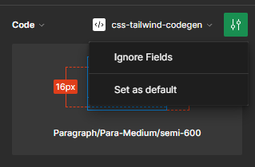
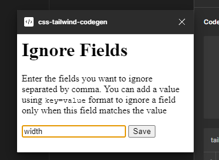
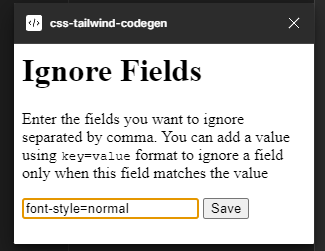

# tailwindcss codegen

This plugin generates tailwind class names in Figma's dev mode.

No login or other AI stuff.

[Try it today](https://www.figma.com/community/plugin/1295012016362159423)

## How to use

1. Toggle the dev mode in Figma
2. Go to plugins and select css-tailwind-codegen
3. Select the layers you want to generate the class names for

## Features

-   Generates class names for the selected layers
-   Ignore specific fields

    - Click on Inspect Settings and select Ignore Fields
    - 
    - Type the property name you want to ignore
    - 
    - You can also specify a value with the property name only to ignore this field when it has a specific value
    - 
    - Click Save and done
